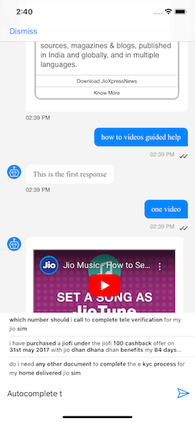

# Autocomplete support
Chat SDK supports autocomplete for `bold ai` chats.     
While user is typing a query to the bot agent, if feature is enabled, he will be presented with suggested articles
relevant to the typed content.
## In Chat autocomplete  

### How to enable/disable chat autocomplete support
#### Enable/Disable on "Bold360ai" console   
  To set the autocomplete feature status in the console:
  1. [**Set on account settings**](./images/Android/ai-console-account-settings.png) 
### Enable/Disable on client side settings</U>   
  Set the feature enable status on the `AutoCompleteConfiguration` that can be provided to `ChatController`.
```swift
chatController.viewConfiguration.searchViewConfig.autoCompleteConfiguration?.isEnabled = false
```
## 
 **!! Notice:** _Client side settings overrides console settings._   
    But, in case the autocomplete was enabled on the client side but disabled on the bold ai console, on the account settings, though the autocomplete is enabled and passes requests, no suggestions will be received nor displayed.   
##

### How to configure
Autocomplete configurations should be set by `ChatController.ChatConfiguration.SearchViewConfiguration.AutoCompleteConfiguration`
```swift
chatController.viewConfiguration.searchViewConfig.textColor = UIColor.green
chatController.viewConfiguration.searchViewConfig.font = UIFont(name: "Times New Roman", size: 50)
chatController.viewConfiguration.searchViewConfig.autoCompleteConfiguration?.font = UIFont(name: "Times New Roman", size: 14)
chatController.viewConfiguration.searchViewConfig.autoCompleteConfiguration?.textColor = UIColor.yellow
```
## Standalone Bot autocomplete component
The SDK provides a standalone bot autocomplete component, `SearchViewController`.
## How to use
1. Override `prepare` to get `SearchViewController`.
```swift
override func prepare(for segue: UIStoryboardSegue, sender: Any?) {
    // Get the new view controller using segue.destination.
    // Pass the selected object to the new view controller.
    guard let controller = segue.destination as? SearchViewController else {
        return
    }
}
```
2. Update suggestions open direction by setting `autoCompleteOnTop`.
```swift
// foe example
 controller.autoCompleteOnTop = true
```
3. Set the controller account.
```swift
controller.account = self.createAccount()
// Set relevant account params
func createAccount() -> Account {
        let account = BotAccount()
        account.account = ""
        account.knowledgeBase = ""
        return account
}
```
4. Set view configurations on controller.
```swift
// For example
controller.view.layer.borderColor = UIColor.red.cgColor
controller.view.layer.borderWidth = 2.0
```
5. Register to controller's delegate `AutoCompletePickDelegate`.
```swift
controller.articlePickDelegate = self
```
> Note: at the end `prepare` method should look like below:
```swift
override func prepare(for segue: UIStoryboardSegue, sender: Any?) {
    // Get the new view controller using segue.destination.
    // Pass the selected object to the new view controller.
    guard let controller = segue.destination as? SearchViewController else {
        return
    }
    if segue.identifier == "Top" {
        controller.autoCompleteOnTop = true
    }
    controller.articlePickDelegate = self
    controller.account = self.account
    controller.view.layer.borderColor = UIColor.red.cgColor
    controller.view.layer.borderWidth = 2.0
}
```
### Listening to events
> Please implement `AutoCompletePickDelegate`.
```swift
extension AutoCompleteViewController: AutoCompletePickDelegate {
   func didSelectSuggestion(_ articleId: String, query: String) {     
   }
   func didFetchArticle(_ article: NRConversationalResponse) {     
   }
   func didFailToFetchAnArticleWithError(_ error: Error) {
   }
}
```
## How to configure
Autocomplete configurations should be set by `AutoCompleteConfiguration` under `SearchViewConfiguration`.
```swift
let config = SearchViewConfiguration()
let autoCompleteConfig = AutoCompleteConfiguration()
autoCompleteConfig.textColor = UIColor.red
config.autoCompleteConfiguration = autoCompleteConfig
controller.configuration = config
```


