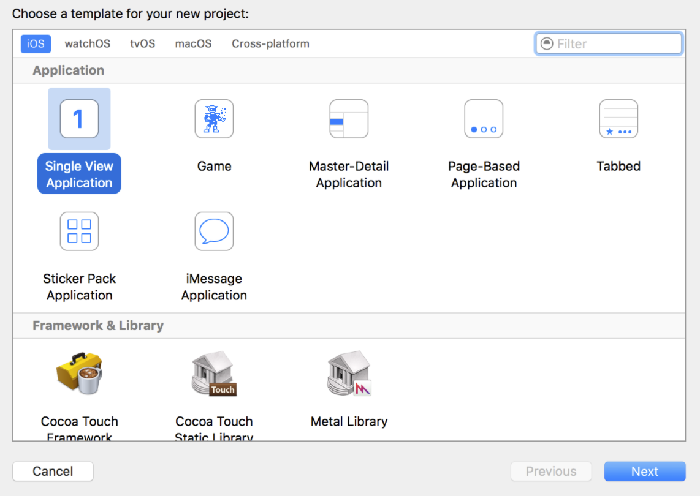

# Quick start
{: .no_toc }

## Table of contents
{: .no_toc .text-delta }

- TOC
{:toc}

---

Use this Quick Start guide to get you up and running with a working AI or live chat hosted by your App.   

## System Requirements  

* [iOS 10 and above](https://developer.apple.com/library/archive/releasenotes/General/WhatsNewIniOS/Articles/iOS10.html#//apple_ref/doc/uid/TP40017084-SW1)

`platform :ios, '10.0'`

* Automatic Reference Counting (ARC) is required in your project.
* With the release of iOS 9 and Xcode 7, a new feature called [App Transport Security (ATS)](https://developer.apple.com/library/content/documentation/General/Reference/InfoPlistKeyReference/Articles/CocoaKeys.html#//apple_ref/doc/uid/TP40009251-SW35) was introduced.
* [CocoaPods](https://guides.cocoapods.org/using/getting-started.html).


## Set up the SDK on your App.
{: .d-inline-block }

Note: Using CocoaPods on an existing Xcode project will modify the project file, so you may want to make a backup before doing this.

1. Create a Podfile in the root directory of your project.

```sh
$ pod init
```

2. Add Official CocoaPods PodSpecs repository to your Podfile:

```ruby
source 'https://github.com/CocoaPods/Specs.git'
```

3. Add bold360ai PodSpecs repository to your Podfile:

```ruby
source 'https://github.com/nanorepsdk/NRSDK-specs.git'
```

4. Add bold360ai iOS SDK to your Podfile:
    
```ruby
pod 'Bold360AI'
```

5. Using *terminal*, with your project root directory as the *working path*, run:

```ruby
pod install
# pod update (use this when you want to get new released version).
```

This will download all the necessary files which are required to integrate the bold360ai into your project.

---

> ! Now you are ready to integrate and create some chats.
{: .no_toc .strong-sub-title}

---

## Create and start a chat  
{: .d-inline-block }

Follow the next steps to create and start a chat.

## Create new Project  

### Set Up a Project in Xcode  

1. Open Xcode and click **start new Xcode Project**:
        

2. Next, select **Single View Application** and click **Next**:
        

3. In the dialog screen displayed, enter the relevant details:
        

### Import SDK

Go to the desired file (e.g., `ViewController.swift`) and add the line below:

```swift
import Bold360AI
```

### Setup Chat Controller

```swift
    var chatController: ChatController!
    var chatControllerDelegate: ChatControllerDelegate!
    var chatHandlerProvider: ChatHandlerProvider!
    var chatViewController: UIViewController!
```

### Setup Live Chat

```swift
// setup Live Chat
extension ViewController {
    @IBAction func setupBoldChat(_ sender: Any) {
        // 1. create account & set
        let account = LiveAccount()
        account.apiKey = {API_KEY}
        self.chatController = ChatController(account: account)
        // 2.  set controller delegate
        self.chatController.delegate = self
    }
}
```

>Make sure to read [chat lifecycle doc](https://developer.bold360.com/help/EN/Bold360API/Bold360API/c_sdk_combined_ios_adv_chat_lifecycle.html) and register to relevant states (e.g `unavailable` state).

### Setup Bot Chat

```swift
// Setup Bot Chat
extension ViewController {
    @IBAction func setupBotChat(_ sender: Any) {
        // 1. create account & set
        let account = self.createAccount()
        self.chatController = ChatController(account: account)
        // 2.  set controller delegate
        self.chatController.delegate = self
    }
    
    func createAccount() -> BotAccount {
        let account = BotAccount()
        account.account = "ACCOUNT"
        account.knowledgeBase = "KNOWLEDGE_BASE"
        account.apiKey = "API_KEY"
        return account;
    }
}
```

#### Use Context

Context is a key-value parameter, so when you create the `BotAccount` object you can set NSDictionary which contains the related context.

``` swift
// Using the context:
botAccount.context = ["someKey": "someValue"]
```

#### Configure Welcome Message Id

When you create the `BotAccount` object you can set welcome message id.

```swift
botAccount.welcomeMessageId = "{WELCOME_MESSAGE_ID}"
```

To Disable Welcome Message 

```swift
botAccount.welcomeMessageId = WelcomeMsgIdNone
```

#### Create Initialization Entities

Entities is a feature of Bold360 that enables querying data from external sources in a conversational format.
If a piece of info is missing from a bot query - the bot asks for the missing data to be able to answer.
The application can populate the entity input values that are available - not to let the bot ask for input params that are "obviously available."

``` swift
// Creating Initialization Entities:
botAccount.initializationEntities = ["someKey1": "someValue1", "someKey1": "someValue2"]
```

### Add Chat View Controller by Implementing Delegate Methods  

```swift
extension ViewController: ChatControllerDelegate {
    func didFailLoadChatWithError(_ error: Error!) {
        print(error.localizedDescription)
    }
    
    func shouldPresentChatViewController(_ viewController: UINavigationController!) {
        // 4. present modally/ as child view controller over your view controller. 
       <YOUR_VIEW_CONTROLLER>.present(viewController, animated: false, completion: nil)
    }
}
```
    

---

### Code Sample
{: .no_toc .text-delta}
[bold360ai samples](https://github.com/bold360ai/bold360-mobile-samples-ios)
